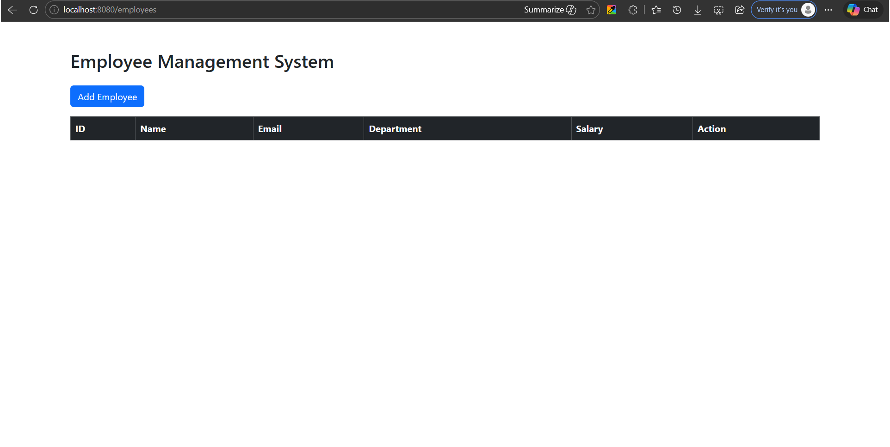
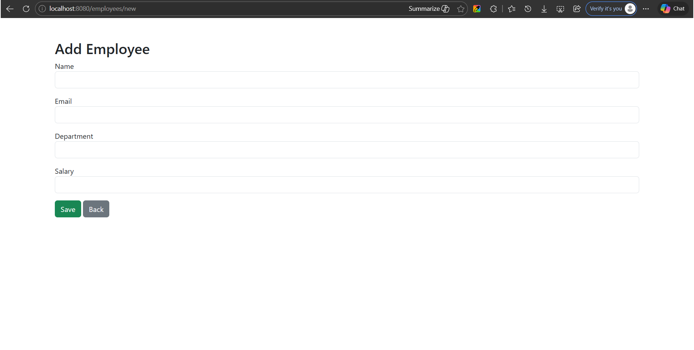

# Employee Management System

A CRUD web application built using **Spring Boot**, **MySQL**, and **Thymeleaf** to manage employee records.

## Features

- Add Employee
- Edit Employee
- Delete Employee
- View Employee Table

## Tech Stack

- Java 17
- Spring Boot
- Spring Data JPA
- Thymeleaf
- MySQL
- Bootstrap

## Project Structure

src/main/java/com/sruthi/employeemanagement
├── controller
├── entity
├── repository
├── service

## How to Run

1. Clone the repository

git clone https://github.com/Sruthi0921/employee-management-system.git

2. Configure MySQL database in `application.properties`

3. Run the application

4. Open browser:

http://localhost:8080/employees

## Screenshots

### Employee List Page

### Add Employee Form

## Author

Sruthi Tammineni
